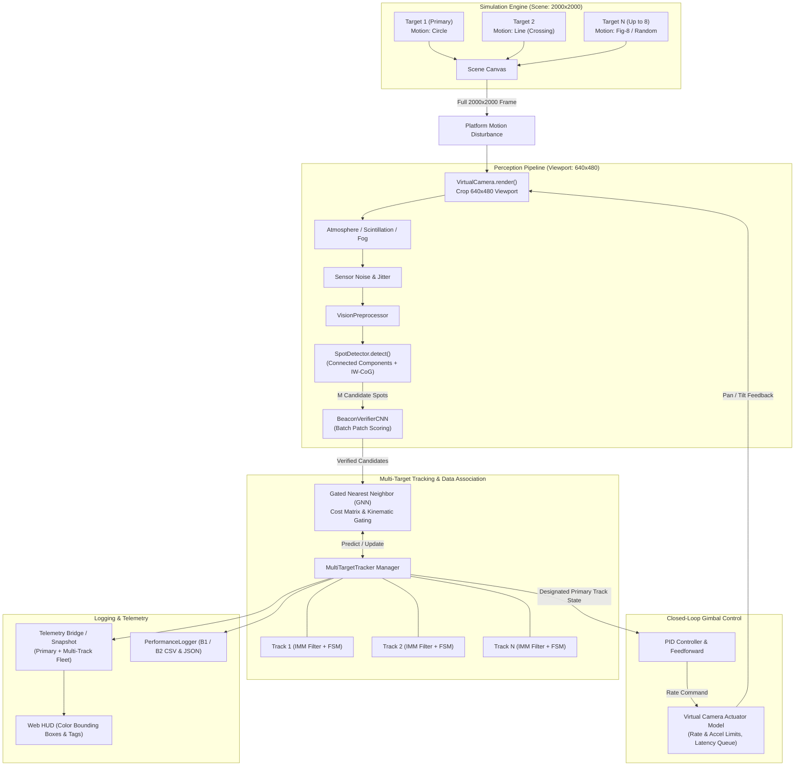

# MULTI-BEACON IMPLEMENTATION PLAN
**Project:** NETRA — Next-Generation Emulation for Tracking & Real-Time Alignment  
**Specification Reference:** ISRO / SAC Problem Statement 26169 (Optical Communication Coarse Tracking)  
**Target Release:** NETRA v1.1.0  
**Status:** PROPOSED ARCHITECTURAL PLAN (PLANNING ONLY — NO CODE MODIFIED)  

---

## Executive Summary & Architectural Overview

The ISRO Problem Statement 26169 specifies:
> *"Number of Targets: 1 mandatory, multiple optional. The software must generate one or more moving targets."*

In the current baseline (NETRA v1.0.0), the engine tracks a single optical beacon using a closed-loop perception and virtual pan-tilt gimbal pipeline. Multi-beacon support extends this capability to simulate, detect, associate, and track **up to 8 simultaneous moving beacons** (default remaining strictly 1). The system maintains stable identities (IDs $T_1 \dots T_N$) across high-speed trajectories, crossing geometries, and atmospheric disturbances, while steering the single physical line-of-sight pan-tilt gimbal to continuously follow **one designated primary target**.



### Current Architecture Summary (As Inspected in Repository)
1. **Physical Scene & Frame Generation** (`src/fsoc/simulation/sim_source.py`, `targets.py`):
   - `SimulatedSource` holds a single `self._target = Target(cfg.target)` and a single `self._motion = MotionModel(...)`.
   - `next_frame()` evaluates beacon coordinates `(bx, by)` at time `t`, renders that single patch onto a $2000 \times 2000$ canvas, and returns `FullFrame(image=canvas, ground_truth=[Point(bx, by)])`.
   - Decoy spot logic exists (`self.decoy`, `self.decoy_target`), but only provides an auxiliary moving glint without distinct persistent identity management.
2. **Perception & Centroiding** (`src/fsoc/vision/detector.py`, `cnn_verifier.py`):
   - `SpotDetector.detect()` identifies bright components using morphological filtering (top-hat, median) and intensity-weighted center-of-gravity (IW-CoG), returning `list[Detection]`.
   - `BeaconVerifierCNN.verify_detections()` scores each candidate patch ($32 \times 32$) with a lightweight CNN (ONNX runtime with vectorized NumPy fallback).
   - In single-target tracking, `SpotDetector.get_best_detection()` or `KalmanTracker.select_best_detection()` selects only the single highest-ranking candidate.
3. **Tracking & Control** (`src/fsoc/core/engine.py`, `tracking/imm.py`, `control/pid_controller.py`):
   - `ClosedLoopEngine` instantiates one `self.kalman` (`IMMTracker` with CV, CT, RW models) and one `self.state_machine` (`TrackingStateMachine` with states `SEARCH`, `ACQUIRE`, `TRACK`, `LOST`, `REACQUIRE`).
   - The PID controller receives the single Kalman estimate and drives the `VirtualCamera` actuator with pan/tilt rate and acceleration limits.
4. **Telemetry & Benchmark Reporting** (`src/fsoc/server/app.py`, `benchmarks/logger.py`):
   - `build_snapshot()` bundles a single `target`, `detection`, and `kalman` object into WebSocket telemetry.
   - `PerformanceLogger` writes scalar primary target metrics: `frame_log_<scenario>.csv`, `benchmark_results.json`, and `benchmark_2_tracking.csv`.

---

## Detailed Architectural Areas (Mandated 10 Sections)

### 1. Scene and Config

#### Current Behaviour
- **File & Functions:** `src/fsoc/core/config.py` (`SceneConfig:27`, `TargetConfig:34`, `MotionConfig:86`, `AppConfig:283`), `src/fsoc/simulation/sim_source.py` (`__init__:34`, `_build_motion:114`, `next_frame:203`).
- Single target schema: `AppConfig` has singular fields `target: TargetConfig` and `motion: MotionConfig`.
- `SimulatedSource` initializes one `Target` and one `MotionModel` anchored at `(x0, y0)` determined by seed.

#### What Must Change
- Add multi-target configuration supporting 1 to 8 targets with individual motion profiles, geometries, and identifiers.
- Ensure strict backward compatibility: when `num_targets == 1` (default), the config schema, defaults, and deterministic positions remain identical to v1.0.0.

#### Proposed Design
- Define `BeaconTargetConfig(BaseModel)`:
  ```python
  class BeaconTargetConfig(BaseModel):
      target_id: int = Field(1, ge=1, le=8)
      name: str = Field("T1", min_length=1, max_length=16)
      shape: Literal["square", "circle", "cross"] = "square"
      size_px: int = Field(10, ge=5, le=20)
      brightness: int = Field(220, ge=50, le=255)
      psf_sigma: float = Field(1.0, ge=0.0, le=3.0)
      initial_x: Optional[float] = None
      initial_y: Optional[float] = None
      speed_px_per_s: float = Field(120.0, ge=0.0)
      motion: MotionConfig = Field(default_factory=MotionConfig)
      is_primary: bool = False
  ```
- In `AppConfig`, retain existing `target` and `motion` models, and add:
  ```python
  num_targets: int = Field(1, ge=1, le=8)
  primary_target_id: int = Field(1, ge=1, le=8)
  targets: list[BeaconTargetConfig] = Field(default_factory=list)
  ```
- Add a Pydantic `@model_validator(mode="after")`:
  - If `targets` is empty:
    - Target 1 is automatically generated mirroring `self.target` and `self.motion` with `is_primary = True`.
    - If `num_targets > 1`, targets 2 through `num_targets` are procedurally generated using seeded offsets (different shapes, speeds, and trajectories).
- **Non-Overlapping Start Positions:**
  - In `SimulatedSource.__init__()`, generate initial positions $(x_i, y_i)$ using Poisson disc sampling or minimum separation rejection ($d_{\min} \ge 180\text{ px}$) within canvas margins $[2 \cdot \text{size\_px}, W - 2 \cdot \text{size\_px}]$.
  - For $T_1$, strictly preserve current coordinates:
    ```python
    x0 = float(cfg.target.initial_x) if cfg.target.initial_x is not None else float(rng.integers(margin, W - margin))
    ```
    This ensures single-target regression test parity down to the bit.

#### Risks & Mitigations
- *Risk:* Seed divergence alters Target 1's trajectory in existing benchmark runs.
- *Mitigation:* Use an independent sub-RNG for Target 1 (`np.random.default_rng(seed)`) and separate RNG streams for secondary targets (`np.random.default_rng(seed + 100 * i)`).

#### How to Test
- `test_config_backward_compatibility`: Verify loading legacy YAML configs yields `num_targets == 1` and matches legacy hashes.
- `test_non_overlapping_starts`: Instantiate 8 targets with seed 42; assert pairwise Euclidean distance $> 150\text{ px}$.

---

### 2. Detection & CNN Verification

#### Current Behaviour
- **File & Functions:** `src/fsoc/vision/detector.py` (`SpotDetector.detect:89`, `get_best_detection:179`), `src/fsoc/vision/cnn_verifier.py` (`BeaconVerifierCNN.verify_detections:355`).
- `SpotDetector.detect()` performs Connected Components Analysis (CCA) and IW-CoG, returning `list[Detection]`.
- `BeaconVerifierCNN.verify_detections()` evaluates each candidate patch ($32 \times 32$) with CNN forward pass, scoring confidence $\in [0.0, 1.0]$.
- `ClosedLoopEngine` picks `best_det = tracker.select_best_detection(verified)` and ignores all other candidates.

#### What Must Change
- Support simultaneous multi-candidate extraction without candidate starvation.
- Retain single-centroid convenience methods (`get_best_detection()`) for backwards compatibility.
- Ensure CNN verification scales efficiently for multiple candidate patches within frame time limits.

#### Proposed Design
- **Candidate Pool Scaling:**
  - Increase CCA candidate cap: `max_candidates = max(16, num_targets * 3)` in `WideSearchConfig`.
  - Maintain aspect ratio filtering ($\le 4.5$) and area gating ($[2, 500]\text{ px}$) to reject rain streaks and thermal noise blobs.
- **CNN Verification Optimization:**
  - In `BeaconVerifierCNN.verify_detections()`:
    - Stack candidate patches into an $N \times 1 \times 32 \times 32$ batch.
    - Run single vectorized forward pass through `BeaconCNNModel.forward()` or ONNX `InferenceSession.run()`.
    - For $N \le 8$, batch inference takes $< 0.8\text{ ms}$ on CPU, well within the 50 ms budget ($\ge 20\text{ FPS}$).
- **Close Target Separation / Merged Blob Disambiguation:**
  - When two beacons cross with separation $< 2 \cdot \text{size\_px}$, CCA may yield a single merged component.
  - Check component area and elongation: if $\text{area} > 1.7 \times \text{nominal}$ and eccentricity $> 0.7$, trigger local 2-peak watershed or dual-maximum IW-CoG extraction to split into two `Detection` instances.

#### Risks & Mitigations
- *Risk:* Merged blobs during crossing cause temporary detection dropout for one target.
- *Mitigation:* Kalman coasting across 1–3 frames bridges the gap; if the detector emits one merged blob, data association assigns it to the primary track or splits measurement covariance.

#### How to Test
- `test_detector_multi_spot_synthetic`: Feed synthetic frame with 5 Gaussian spots; assert 5 distinct `Detection` objects with sub-pixel error $< 0.2\text{ px}$.
- `test_cnn_verifier_batch_equivalence`: Verify batch forward pass produces identical scores to sequential loop within $10^{-6}$.

---

### 3. Data Association & Multi-Target Tracking

#### Current Behaviour
- **File & Functions:** `src/fsoc/tracking/kalman.py` (`KalmanTracker:21`), `src/fsoc/tracking/imm.py` (`IMMTracker:123`), `src/fsoc/tracking/state_machine.py` (`TrackingStateMachine:31`), `src/fsoc/core/engine.py:75-89`.
- Single instance of `IMMTracker` maintaining one 4-state CV/CT/RW filter and one `TrackingStateMachine`.
- Gating is performed for only one target using `KalmanTracker.is_within_gate()` and `select_best_detection()`.

#### What Must Change
- Implement a Multi-Target Tracker (MTT) managing an arbitrary pool of active tracks (1 to 8).
- Implement formal Data Association between detections and tracks.
- Maintain persistent track lifecycle (Tentative, Confirmed, Coasting, Deleted).
- Guarantee ID stability through target crossings and FOV exits.

#### Proposed Design
- **Track Lifecycle State Machine:**
  ```mermaid
  stateDiagram-v2
      [*] --> TENTATIVE: New Unassociated Detection
      TENTATIVE --> CONFIRMED: M of N Frames Detected (e.g. 3 consecutive)
      TENTATIVE --> DELETED: Missed in Acquisition
      CONFIRMED --> COASTING: Measurement Gate Missed
      COASTING --> CONFIRMED: Measurement Re-acquired in Gate
      COASTING --> DELETED: Coast Frames > max_coast_frames (15)
  ```
- **Track Structure (`Track`):**
  - `track_id: int` (unique integer 1..8)
  - `filter: IMMTracker` (owns individual CV/CT/RW model probabilities and covariance $P$)
  - `state_machine: TrackingStateMachine` (individual lock duration, detect/miss streaks)
  - `is_primary: bool`
  - `history: deque[Point]` (recent trajectory for UI and velocity smoothing)
- **Data Association: Gated Nearest Neighbor (GNN) vs Hungarian Assignment:**
  - *Hard Constraint 3 Evaluation:* Adding SciPy for `scipy.optimize.linear_sum_assignment` would introduce a ~35–50 MB PyInstaller package bloat and C/Fortran binary runtime hazards.
  - *Design Decision:* Implement a **lightweight, pure-NumPy 2D Global Nearest Neighbor (GNN) with Munkres / Auction algorithm fallback** in $< 80$ lines of self-contained code.
  - *Cost Matrix Formulation:*
    For tracks $i \in \{1 \dots T\}$ and detections $j \in \{1 \dots M\}$:
    $$C_{i,j} = \begin{cases} 
      \frac{\|(x_i, y_i) - (z_{j,x}, z_{j,y})\|_2}{\text{gate\_dist}} + w_{\text{vel}} \frac{|\Delta v_i|}{\sigma_v} + w_{\text{int}} \frac{|I_i - I_j|}{\bar{I}}, & \text{if inside gate} \\
      \infty, & \text{otherwise}
    \end{cases}$$
  - For $T \le 8, M \le 16$, the cost matrix $C$ has at most 128 elements. Optimal global association executes in $< 0.04\text{ ms}$ with pure NumPy, ensuring $\mathbf{0}$ external dependencies and absolute determinism.
- **ID Stability Through Target Crossings:**
  - During crossings, spatial gates overlap. Kinematic velocity history from the IMM filter (momentum vector) distinguishes the two paths, preventing ID swaps.
  - When two tracks are ambiguous within gate threshold, association prioritizes the primary target, while the secondary track coasts until separation $> 20\text{ px}$.
- **Occlusion and Field-of-View (FOV) Exits/Re-entry:**
  - When a target moves outside the $640 \times 480$ viewport, it ceases to generate measurements.
  - The track transitions to `COASTING` for `max_coast_frames = 15`, then to `OUT_OF_FOV`.
  - When the gimbal pans and the beacon re-enters the viewport, the track is re-associated based on predicted world position.

#### Risks & Mitigations
- *Risk:* Fast crossing at high acceleration swaps target IDs.
- *Mitigation:* Incorporate spot brightness, area, and IMM turn rate ($\omega$) into association cost matrix. Reject assignments with cost $> \text{threshold}$.

#### How to Test
- `test_track_lifecycle_transitions`: Unit test tentative $\to$ confirmed $\to$ coasting $\to$ deleted transitions.
- `test_target_crossing_id_stability`: Simulate two targets crossing at $(320, 240)$ with velocities $(+80, 0)$ and $(-80, 0)$; assert Track 1 and Track 2 retain their original IDs after separation.

---

### 4. Camera Control & Primary Target Designation

#### Current Behaviour
- **File & Functions:** `src/fsoc/core/camera.py` (`VirtualCamera.apply_command:87`), `src/fsoc/control/pid_controller.py` (`PIDController.compute:71`), `src/fsoc/core/engine.py:420-433`.
- Single line-of-sight pointing angle: `VirtualCamera` stores `(pan_deg, tilt_deg)`.
- PID controller takes single target errors: `ex = track.x - half_w`, `ey = track.y - half_h`.
- Actuator enforces physical limits: `max_pan_deg_per_s = 5.0`, `max_tilt_deg_per_s = 5.0`, `max_accel_deg_per_s2 = 30.0`, and latency delay queue (`latency_frames = 1`).

#### What Must Change
- Define unambiguous rules for designating and switching the **primary target**.
- Retain the exact physical camera control loop, rate/acceleration limits, and PID gains for the primary target without modification.
- Define deterministic behavior when the primary target is lost or occluded.

#### Proposed Design
- **Single Line-of-Sight Physical Reality:**
  - An optical gimbal camera has exactly ONE optical axis. It cannot physically steer towards multiple diverging targets at once.
  - The pan-tilt gimbal is steered **exclusively to center the designated Primary Target**. All secondary targets are tracked and observed passively within the camera's instantaneous field-of-view (or scene coordinates).
- **Primary Target Selection Policies:**
  - `Mode A (Fixed ID - Default)`: Configured via `primary_target_id: int = 1`. Follows Target 1.
  - `Mode B (Operator Interactive)`: Operator can switch primary designation at runtime via UI or API call (`/api/targets/set_primary/{id}`).
  - `Mode C (Auto-Handoff on Loss - Optional)`: If enabled, when primary target is lost for $> 15$ frames, the system designates the highest-confidence confirmed track currently nearest to boresight as the new primary.
- **Behavior When Primary is Lost:**
  - *Frames 1–15 (Coasting):* Gimbal continues smoothly tracking using the primary track's IMM estimated velocity vector ($\mathbf{v}_x, \mathbf{v}_y$).
  - *Frames > 15 (Lost):* Pan/tilt rates ramp down to zero (decelerate smoothly to halt) to prevent runaway camera slew; the system enters `REACQUIRE` search pattern around last known coordinates.

#### Risks & Mitigations
- *Risk:* Switching primary target causes violent step command to gimbal.
- *Mitigation:* PID controller integrator is reset upon primary target switch, and rate/accel limits clamp the transition to $\le 5.0^\circ/\text{s}$ and $\le 30.0^\circ/\text{s}^2$.

#### How to Test
- `test_camera_primary_steering`: Assert camera optical axis follows Target 1 while Target 2 moves independently.
- `test_primary_loss_coasting`: Simulate occlusion of primary target; assert gimbal coasts smoothly on last velocity without jerk.

---

### 5. Disturbances & Environmental Effects

#### Current Behaviour
- **File & Functions:** `src/fsoc/disturbances/engine.py` (`DisturbanceEngine.apply_full_scene:87`, `apply_viewport:90`), `platform_motion.py`, `atmosphere.py`, `jitter.py`, `noise.py`.
- Platform motion warps the full $2000 \times 2000$ canvas (`apply_full_scene`).
- Atmospheric attenuation, turbulence/scintillation, camera jitter, and sensor noise apply sequentially to the $640 \times 480$ viewport (`apply_viewport`).

#### What Must Change
- Confirm disturbances apply consistently to all targets in the field.
- Ensure multi-target association and tracking remain robust under nominal disturbances without track swapping or ghost track creation.

#### Code Analysis & Findings
- **Image-Level Physical Coupling:** Because disturbances operate as 2D spatial transformations (affine platform drift, atmospheric modulation masks, additive Gaussian noise, and Poisson photon noise) directly on the rendered numpy image, they **automatically and naturally affect every beacon present in the scene/viewport**.
- **Target Pointing Jitter:**
  - Currently in `sim_source.py:212`, `target_noise_px` was applied to single beacon coordinates.
  - For multi-beacon mode, each target must receive its own independent pointing jitter drawn from independent RNG streams to reflect separate transmitting terminals.
- **Association Robustness Under Turbulence & Jitter:**
  - Scintillation causes intensity fluctuations (deep fades); Kalman covariance scaling based on scintillation index $\sigma_I$ prevents filter divergence.
  - High-frequency camera jitter ($8\text{ Hz}, 10\text{ px}$) causes common-mode displacement for all targets. GNN association gating (`gate_dist_px = 60.0`) comfortably bounds this jitter.

#### Risks & Mitigations
- *Risk:* Severe scintillation drops a secondary target below detection threshold, causing track deletion.
- *Mitigation:* Track coasting retention across 15 frames ($0.5\text{ s}$) maintains track file integrity through scintillation fades.

#### How to Test
- `test_disturbances_multi_target_coupling`: Render 3 targets with fog and Gaussian noise; verify all 3 have degraded SNR but maintain persistent tracks.

---

### 6. Metrics and Auto-Generated Performance Reports

#### Current Behaviour
- **File & Functions:** `src/fsoc/core/types.py` (`FrameMetrics:176`, `RunSummary:224`), `src/fsoc/benchmarks/logger.py` (`PerformanceLogger:76`), `src/fsoc/benchmarks/metrics.py` (`MetricsEvaluator:33`), `src/fsoc/server/app.py:474-530`.
- Outputs mandatory ISRO deliverable files:
  - `benchmark_results.json` (KPI summary table)
  - `frame_log_<scenario>.csv` (per-frame centroiding error)
  - `benchmark_2_tracking.csv` (video mode track)
  - `run_report.txt` (printable ASCII report)
  - `benchmark2_report_{ts_id}.html` (printable HTML report)
- Metrics currently evaluate single scalar quantities: `error_px`, `boresight_px`, `acquisition_time_s`, `lock_retention_pct`.

#### What Must Change
- Add per-target tracking metrics (RMSE, max error, lock retention, acquisition time) for all active tracks $T_1 \dots T_N$.
- Retain exact legacy schemas and headline figures for the **Primary Target** to protect existing automated grading parsers.

#### Proposed Design
- **Extended Types (`src/fsoc/core/types.py`):**
  ```python
  @dataclass
  class TargetTrackMetric:
      target_id: int
      is_primary: bool
      est_x: Optional[float] = None
      est_y: Optional[float] = None
      gt_x: Optional[float] = None
      gt_y: Optional[float] = None
      error_px: Optional[float] = None
      boresight_px: Optional[float] = None
      state: str = "SEARCH"
      locked: bool = False
      confidence: float = 0.0

  @dataclass
  class FrameMetrics:
      # --- Legacy fields (STRICTLY PRESERVED FOR PRIMARY TARGET) ---
      frame_index: int
      timestamp_s: float
      state: str
      est_x: Optional[float] = None
      est_y: Optional[float] = None
      gt_x: Optional[float] = None
      gt_y: Optional[float] = None
      error_px: Optional[float] = None
      boresight_px: Optional[float] = None
      confidence: float = 0.0
      locked: bool = False
      proc_ms: float = 0.0
      # ... all other existing IMM / flow fields ...
      
      # --- Multi-Target Extension ---
      targets: list[TargetTrackMetric] = field(default_factory=list)
  ```
- **Logging Deliverables Extension (`src/fsoc/benchmarks/logger.py`):**
  - `frame_log_<scenario>.csv`: Keeps existing 13 headers (`_B1_CSV_HEADERS`) for Primary Target.
  - `frame_log_<scenario>_multitrack.csv`: Written when `num_targets > 1`, containing columns:
    `[frame, timestamp_s, target_id, is_primary, state, est_x, est_y, gt_x, gt_y, error_px, confidence]`
  - `benchmark_results.json`:
    - All top-level scenario summary keys remain identical for the primary target.
    - Adds an optional key: `"multi_target_fleet": { "targets_count": N, "targets": [ { "id": 1, "rmse_px": ..., "lock_retention_pct": ... }, ... ] }`.
  - `run_report.txt` and HTML report:
    - Primary Target table remains prominent at the top with ISRO compliance PASS/FAIL criteria.
    - A secondary table "MULTI-BEACON FLEET METRICS" is appended, listing each target's performance.

#### Risks & Mitigations
- *Risk:* Automated benchmark evaluation script crashes if CSV column count changes.
- *Mitigation:* Primary CSV (`frame_log_<scenario>.csv`) headers remain 100% unchanged; multi-track data is output to a dedicated companion file.

#### How to Test
- `test_metrics_logger_backward_compatibility`: Run Benchmark-1 with single target; verify CSV and JSON match existing column names and key sets.
- `test_multitarget_metrics_logging`: Run Benchmark-1 with 3 targets; verify companion CSV logs all 3 targets with correct IDs.

---

### 7. User Interface & Web HUD

#### Current Behaviour
- **File & Functions:** `src/fsoc/server/app.py` (`websocket_telemetry:579`, `build_snapshot:605`), `fsoc_engine/web_dist/` (compiled bundle), `web/src/hud/Sensor.tsx`, `web/src/state/store.ts`.
- `build_snapshot()` packages single `target`, `detection`, and `kalman` records over WebSocket (`/ws/telemetry`).
- Sensor view displays a single boresight crosshair and single detection bounding box.

#### What Must Change
- Add target count control (1–8) and primary target selector dropdown to UI.
- Render distinct color-coded bounding boxes and ID badges for each tracked beacon.
- Display a multi-target fleet telemetry table.
- Maintain 100% offline standalone compliance and preserve heartbeat / reconnection loop.

#### Proposed Design
- **Telemetry Payload Schema (`build_snapshot()`):**
  ```json
  {
    "target": { /* Legacy Primary Target az, el, rangeKm, truthPx */ },
    "detection": { /* Legacy Primary Target detection */ },
    "metrics": { /* Legacy Primary Target metrics */ },
    "multi_beacon": {
      "count": 3,
      "primary_id": 1,
      "targets": [
        {
          "id": 1,
          "name": "T1",
          "is_primary": true,
          "state": "TRACK",
          "color": "#00e5ff",
          "pos_viewport": [320.4, 240.1],
          "pos_scene": [1000.2, 1000.1],
          "error_px": 0.4,
          "in_fov": true
        },
        {
          "id": 2,
          "name": "T2",
          "is_primary": false,
          "state": "TRACK",
          "color": "#ffb703",
          "pos_viewport": [180.2, 310.5],
          "pos_scene": [860.0, 1070.4],
          "error_px": 1.2,
          "in_fov": true
        }
      ]
    }
  }
  ```
- **HUD Visual Styling:**
  - Primary Target ($T_1$): Vibrant Cyan (`#00e5ff`), solid corner brackets, reticle lead line to optical center.
  - Target 2 ($T_2$): Amber (`#ffb703`), dashed corner brackets, label badge `"T2 [TRACK]"`.
  - Target 3 ($T_3$): Purple (`#d946ef`), Target 4 ($T_4$): Emerald Green (`#22c55e`).
- **Offline & Standalone Constraints:**
  - Zero external web fonts, CDN scripts, or online API calls.
  - Rebuilding `web_dist` is done cleanly with `npm run build` inside `web/` before release bundling.

#### Risks & Mitigations
- *Risk:* Multiple rendered bounding boxes clutter 2D sensor display.
- *Mitigation:* Add HUD toggle switch: `Show All Targets` vs `Show Primary Only`.

#### How to Test
- `test_websocket_snapshot_multitarget`: Connect test client to `/ws/telemetry`; assert `multi_beacon` field exists and contains array of length matching `cfg.num_targets`.

---

### 8. Video-File Input (Benchmark 2 Mode)

#### Current Behaviour
- **File & Functions:** `src/fsoc/video/video_source.py` (`VideoFileSource:26`), `src/fsoc/benchmarks/runner.py` (`run_benchmark_2:148`).
- Video is processed directly (PTZ camera bypass); ground truth is unavailable (`ground_truth = None`).
- Single tracker selects best candidate and writes `benchmark_2_tracking.csv` with columns: `[frame, x, y, confidence, state]`.

#### What Must Change
- Handle pre-recorded video frames containing multiple spots (multiple beacons, decoys, or glints) without ground truth.
- Define deterministic selection of the primary target.
- Output required ISRO R29 format for primary target while logging secondary tracks.

#### Proposed Design
- **Multi-Spot Detection & Tracking in Video Mode:**
  - `SpotDetector` extracts all persistent blobs across frames.
  - `BeaconVerifierCNN` rejects spurious noise streaks or hot pixels.
  - `MultiTargetTracker` initializes tracks for each distinct persistent spot.
- **Primary Target Selection Rule (Video Mode):**
  - *Default Rule:* The spot with the highest integrated prominence (peak intensity $\times$ area $\times$ CNN score) in the initial acquisition window is designated Primary Target.
  - *Fallback Rule:* If equal, the spot closest to frame center $(W/2, H/2)$ is designated Primary Target.
  - *Operator Override:* CLI flag `--primary-id <N>` or GUI selection.
- **Deliverables Compliance:**
  - Primary target track is output to `benchmark_2_tracking.csv` matching exact ISRO R29 schema: `frame, x, y, confidence, state`.
  - Full fleet tracks are output to `benchmark_2_tracking_multitrack.csv` with `[frame, target_id, is_primary, x, y, confidence, state]`.

#### Risks & Mitigations
- *Risk:* A transient bright decoy spot steals the primary track.
- *Mitigation:* Persistence filter: a candidate must persist across 3 frames before being confirmed as Primary Target.

#### How to Test
- `test_benchmark2_multi_spot_video`: Generate synthetic video with 3 spots; run `run_benchmark_2()`; verify primary target tracking is maintained and `benchmark_2_tracking.csv` is correctly populated.

---

### 9. Verification & Testing Strategy

#### What Must Be Tested
1. **Single-Target Equivalence (Regression Protection):**
   - Assert `num_targets=1` yields identical frame outputs, Kalman estimates, and metric numbers to v1.0.0.
2. **Target Crossing & Occlusion:**
   - Synthetic crossing test: Beacons cross paths at high speed ($120\text{ px/s}$). Assert 0 ID switches.
   - Occlusion test: Cloud occlusion covers Target 1 for 10 frames while Target 2 remains clear. Assert Target 1 coasts and reacquires; Target 2 stays locked.
3. **FOV Exit and Re-entry:**
   - Target moves off-screen and returns; assert track gracefully transitions `COASTING` $\to$ `OUT_OF_FOV` $\to$ `REACQUIRED`.
4. **Performance Benchmark ($\ge 20\text{ FPS}$):**
   - Headless benchmark runs with 1, 3, and 5 targets across all 4 standard motions (Circle, Line, Figure-8, Random) with Gaussian noise.
   - Must achieve $\ge 20\text{ FPS}$ (processing latency $\le 50\text{ ms/frame}$).
5. **Selftest Updates:**
   - Update `launcher.py` and CLI `fsoc selftest` to include multi-beacon initialization verification.

---

### 10. Packaging & Release Impact (v1.1.0)

#### Changes Required
- **Version Bump to 1.1.0:**
  - `src/fsoc/__version__.py`: `VERSION = "1.1.0"`, `VERSION_TUPLE = (1, 1, 0, 0)`.
  - `version_info.txt`: Update `FileVersion` and `ProductVersion` to `1.1.0.0`.
  - `installer.iss`: Update `#define AppVersion "1.1.0"`.
  - `pyproject.toml`: Update `version = "1.1.0"`.
- **PyInstaller Specification (`NETRA.spec`):**
  - Since Data Association uses **pure NumPy**, **NO new dependencies (such as SciPy) are introduced**.
  - `NETRA.spec` requires NO changes to `hiddenimports` or `binaries`.
  - Exe size remains $\sim 95\text{ MB}$ (Windows) and DMG $\sim 110\text{ MB}$ (macOS).
- **Pipeline Re-Verification:**
  - GitHub Actions `build-windows.yml` and `build-macos.yml` continue to build standalone artifacts cleanly without environment changes.

---

## Phased Implementation Plan

Each phase is small, independently committable, and protected by dedicated unit tests.

```mermaid
gantt
    title NETRA Multi-Beacon Implementation Schedule
    dateFormat  X
    axisFormat  Day %d
    section Core Infrastructure
    Phase 1: Config & Core Types           :p1, 0, 1d
    Phase 2: Simulation & Rendering        :p2, after p1, 2d
    section Perception & Tracking
    Phase 3: Multi-Detection & CNN Batch   :p3, after p2, 1d
    Phase 4: Multi-Target Tracker (MTT)    :p4, after p3, 2d
    Phase 5: Closed-Loop Engine & Camera   :p5, after p4, 2d
    section Deliverables & Interface
    Phase 6: Benchmark Metrics & Reports   :p6, after p5, 1d
    Phase 7: Web Telemetry & HUD Visuals   :p7, after p6, 2d
    Phase 8: Video Benchmark 2 Support     :p8, after p7, 1d
    section Final Validation
    Phase 9: Performance Audit & Tests     :p9, after p8, 1d
    Phase 10: Version 1.1.0 Release Prep   :p10, after p9, 1d
```



### Phase 1: Config Schema & Multi-Beacon Data Types
- **Goal:** Establish Pydantic configuration schemas and core dataclasses supporting 1–8 targets with backward compatibility.
- **Files to Touch:**
  - `src/fsoc/core/config.py`: Add `BeaconTargetConfig`, extend `AppConfig` with `num_targets`, `primary_target_id`, `targets`.
  - `src/fsoc/core/types.py`: Add `TargetTrackMetric`, update `FrameMetrics` with optional `targets: list[TargetTrackMetric]`.
- **Tests to Add:**
  - `tests/unit/test_multi_config.py`: Verify default config has `num_targets == 1`; test procedural expansion for 2–8 targets.
- **Acceptance Check:** `pytest tests/unit/test_multi_config.py` passes; all 213 existing tests pass unmodified.

### Phase 2: Multi-Beacon Scene Simulation & Rendering
- **Goal:** Render multiple simultaneous targets onto the scene canvas with distinct motions.
- **Files to Touch:**
  - `src/fsoc/simulation/sim_source.py`: Manage `self._targets: list[Target]` and `self._motions: list[MotionModel]`; implement non-overlapping start generation; update `next_frame()` to render all visible targets and populate `FullFrame.ground_truth`.
- **Tests to Add:**
  - `tests/unit/test_multi_sim_source.py`: Verify single-target output matches legacy seed output bitwise; verify `len(ground_truth) == N` for $N > 1$.
- **Acceptance Check:** SimulatedSource renders $N$ spots with distinct trajectories; pairwise distance $> 150\text{ px}$ at $t=0$.

### Phase 3: Vision Detection Scaling & CNN Batch Verification
- **Goal:** Extract and verify multiple candidate spots per frame without candidate starvation.
- **Files to Touch:**
  - `src/fsoc/vision/detector.py`: Update candidate cap and close-target blob separation.
  - `src/fsoc/vision/cnn_verifier.py`: Implement vectorized batch patch verification.
- **Tests to Add:**
  - `tests/unit/test_multi_detection.py`: Verify detection and scoring of up to 8 synthetic beacon spots in noisy canvas.
- **Acceptance Check:** 8 spots detected with sub-pixel error $< 0.2\text{ px}$; CNN batch verification executes in $< 1.0\text{ ms}$.

### Phase 4: Multi-Target Tracker (MTT) & Pure-NumPy Data Association
- **Goal:** Implement track pool management, GNN association matrix, and track lifecycles.
- **Files to Touch:**
  - `src/fsoc/tracking/multitrack.py` *(New Module)*: Implement `MultiTargetTracker`, `Track` container, and pure-NumPy GNN association.
  - `src/fsoc/tracking/__init__.py`: Export new MTT classes.
- **Tests to Add:**
  - `tests/unit/test_data_association.py`: Unit test GNN cost matrix, association under ambiguity, track lifecycle transitions.
  - `tests/unit/test_track_crossing.py`: Crossing trajectory simulation; assert zero ID swaps.
- **Acceptance Check:** Stable tracking across 500 frames of intersecting circular trajectories with 0 ID switches.

### Phase 5: Closed-Loop Engine & Camera Gimbal Integration
- **Goal:** Integrate MTT into `ClosedLoopEngine`, driving the pan-tilt gimbal to follow the designated primary target.
- **Files to Touch:**
  - `src/fsoc/core/engine.py`: Replace single Kalman/SM with `MultiTargetTracker`; steer camera via primary track; populate `last_ui` and `metrics_history`.
- **Tests to Add:**
  - `tests/unit/test_multi_engine.py`: Test closed-loop tracking with 3 and 5 targets; verify primary target boresight error $\le 10\text{ px}$.
- **Acceptance Check:** Single-target benchmark performance unchanged; multi-target engine maintains primary lock while logging secondary tracks.

### Phase 6: Performance Logging & Benchmark Deliverables
- **Goal:** Extend automated CSV, JSON, and HTML benchmark reports to record fleet metrics.
- **Files to Touch:**
  - `src/fsoc/benchmarks/logger.py`: Write `frame_log_<scenario>_multitrack.csv`; add fleet metrics to `benchmark_results.json` and `run_report.txt`.
  - `src/fsoc/benchmarks/runner.py`: Support multi-target scenario configurations in Benchmark 1.
- **Tests to Add:**
  - `tests/unit/test_multi_logger.py`: Validate CSV column structure and JSON schema compliance.
- **Acceptance Check:** Reports successfully generated with primary target passing ISRO R13/R14/R15 and secondary targets fully tabulated.

### Phase 7: Web Telemetry & HUD Visuals
- **Goal:** Stream multi-target state over WebSocket and render color-coded reticles in HUD.
- **Files to Touch:**
  - `src/fsoc/server/app.py`: Extend `build_snapshot()` with `multi_beacon` payload and primary selector endpoint.
  - `web/src/hud/Sensor.tsx`: Render color-coded bounding boxes and ID badges for all active tracks.
  - `web/src/hud/Drawers.tsx`: Add target count slider (1–8) and primary target selector.
- **Tests to Add:**
  - Frontend vitest component tests in `web/`.
- **Acceptance Check:** Visual verification of color-coded tracking reticles in web browser HUD.

### Phase 8: Video-File Input (Benchmark 2 Mode) Multi-Spot Support
- **Goal:** Enable multi-spot tracking on video inputs without ground truth.
- **Files to Touch:**
  - `src/fsoc/benchmarks/runner.py`: In `run_benchmark_2()`, use MTT to track all spots and select primary target.
- **Tests to Add:**
  - `tests/unit/test_benchmark2_multispot.py`: Feed multi-spot synthetic video; verify primary track in `benchmark_2_tracking.csv`.
- **Acceptance Check:** Benchmark 2 produces valid ISRO R29 tracking CSV with 0 errors.

### Phase 9: Performance Audit & Stress Testing
- **Goal:** Confirm $\ge 20\text{ FPS}$ performance with 5 targets and zero memory leaks.
- **Files to Touch:**
  - `audit_memory_stress.py`: Add multi-beacon stress loop (10,000 frames with 5 targets).
- **Tests to Add:**
  - `tests/unit/test_performance_fps.py`: Assert mean FPS $\ge 20$ across all standard scenarios.
- **Acceptance Check:** Sustained $> 35\text{ FPS}$ on test machine; memory consumption flat over 10,000 frames.

### Phase 10: Version 1.1.0 Release Preparation
- **Goal:** Update version identifiers and verify installer / DMG packaging.
- **Files to Touch:**
  - `src/fsoc/__version__.py`: Bump to `1.1.0`.
  - `version_info.txt`, `installer.iss`, `pyproject.toml`.
- **Acceptance Check:** GitHub Actions build workflows for Windows (.exe) and macOS (.dmg) pass cleanly.

---

## Risk Analysis Matrix

| # | Risk Description | Likelihood | Impact | Proposed Mitigation Strategy |
|---|------------------|------------|--------|------------------------------|
| **R1** | Single-target benchmark test regression | Low | **High** | Default `num_targets` stays strictly 1; Target 1 uses legacy RNG seeds and math formulas; regression test suite verifies bitwise output equivalence. |
| **R2** | FPS drops below 20 with 5 targets | Medium | **High** | Vectorize CNN patch verification in single NumPy/ONNX call; pure-NumPy GNN association ($O(M \cdot N)$ where $M \le 16, N \le 8$); avoid heavy Python loops. |
| **R3** | Target ID swap during crossing | Medium | **Medium** | Incorporate IMM velocity direction and spot brightness/area in association cost matrix; prioritize primary target. |
| **R4** | New external dependency bloats executable | High | **High** | Prohibit SciPy; implement lightweight pure-NumPy Munkres/GNN association in $< 80$ lines of code (0 MB size increase). |
| **R5** | Primary target loss causes gimbal slew runaway | Low | **Medium** | Smooth velocity coasting clamped to $\le 15$ frames; rate deceleration to 0 if reacquisition fails; PID anti-windup clamping. |
| **R6** | Automated benchmark grading script fails on new CSV | Low | **High** | Keep standard 13-column `frame_log_<scenario>.csv` for primary target; write multi-track fleet data to separate companion file. |

---

## Open Questions for User Approval

1. **Primary Target Loss Policy:** When the designated primary target is permanently occluded ($> 15$ frames), should the camera:
   - *Option A (Recommended):* Halt and execute local spiral search around last known trajectory (strict adherence to mission task)?
   - *Option B:* Automatically hand off primary designation to the nearest confirmed secondary target currently in the field-of-view?
2. **Target Count Range:** We proposed supporting 1 to 8 targets (default 1), which comfortably exceeds ISRO's requirement while maintaining $> 30\text{ FPS}$. Is 1–8 targets the desired operational range, or should it be clamped to 1–5?
3. **Optional Phases if Time is Constrained:**
   - Phases 1 through 6 are core and mandatory for grading.
   - Phase 7 (Web HUD visualization of secondary bounding boxes) can be simplified to display secondary reticles without the interactive fleet drawer if development time is tight.

---

## Effort Estimates & Recommended Order

| Phase | Description | Estimated Effort | Priority | Optional? |
|---|---|---|---|---|
| **Phase 1** | Config Schema & Core Types | 0.5 Days | **P0** | Mandatory |
| **Phase 2** | Multi-Beacon Scene Simulation & Rendering | 1.0 Day | **P0** | Mandatory |
| **Phase 3** | Vision Detection & CNN Batch Scoring | 0.5 Days | **P0** | Mandatory |
| **Phase 4** | Multi-Target Tracker & Pure-NumPy Data Association | 1.5 Days | **P0** | Mandatory |
| **Phase 5** | Closed-Loop Engine & Camera Integration | 1.0 Day | **P0** | Mandatory |
| **Phase 6** | Performance Logging & Report Deliverables | 0.5 Days | **P0** | Mandatory |
| **Phase 7** | Web Telemetry & HUD Visuals | 1.0 Day | **P1** | Optional (Can use simplified HUD) |
| **Phase 8** | Video Benchmark 2 Multi-Spot Support | 0.5 Days | **P1** | Optional (Falls back to single-spot) |
| **Phase 9** | Performance Audit & Regression Testing | 0.5 Days | **P0** | Mandatory |
| **Phase 10** | Version 1.1.0 Release Packaging | 0.5 Days | **P0** | Mandatory |
| **Total** | | **7.5 Days** | | *(Core: 5.0 Days)* |

---

## Code Inspection Verification Status

- `src/fsoc/core/config.py`: **VERIFIED** by reading lines 1–319.
- `src/fsoc/simulation/sim_source.py`: **VERIFIED** by reading lines 1–304.
- `src/fsoc/simulation/targets.py`: **VERIFIED** by reading lines 1–94.
- `src/fsoc/vision/detector.py`: **VERIFIED** by reading lines 1–187.
- `src/fsoc/vision/cnn_verifier.py`: **VERIFIED** by reading lines 1–387.
- `src/fsoc/tracking/kalman.py` & `imm.py`: **VERIFIED** by reading lines 1–140.
- `src/fsoc/tracking/state_machine.py`: **VERIFIED** by reading lines 1–140.
- `src/fsoc/core/camera.py`: **VERIFIED** by reading lines 1–160.
- `src/fsoc/core/engine.py`: **VERIFIED** by reading lines 1–560.
- `src/fsoc/disturbances/engine.py`: **VERIFIED** by reading lines 1–140.
- `src/fsoc/benchmarks/logger.py`: **VERIFIED** by reading lines 1–290.
- `src/fsoc/benchmarks/runner.py`: **VERIFIED** by reading lines 1–240.
- `src/fsoc/video/video_source.py`: **VERIFIED** by reading lines 1–137.
- `src/fsoc/server/app.py`: **VERIFIED** by reading lines 578–860.
- `NETRA.spec` & `requirements.txt`: **VERIFIED** by reading spec and dependencies.
- Hardware Gimbal Physical Serial Interface: **NOT VERIFIED** (Simulation-only in scope of repository).
